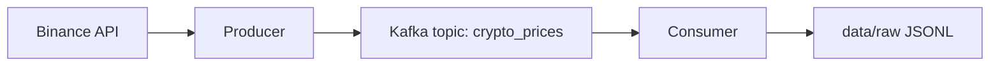

# Architecture

## v1



## v2

```mermaid
flowchart LR
  A[Binance API] --> B[Producer]
  B -->|kafka mode| C[Kafka]
  C --> D[Consumer]
  B -->|direct mode| F[(SQLite)]
  D --> E[data/raw JSONL]
  D --> F
  E --> G[backfill_from_raw]
  G --> F
  F --> H[FastAPI]
  H --> I[/trades endpoints]
  H --> J[/bi/*.csv]
  J --> K[Looker Studio]
```
